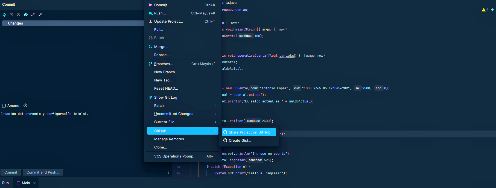
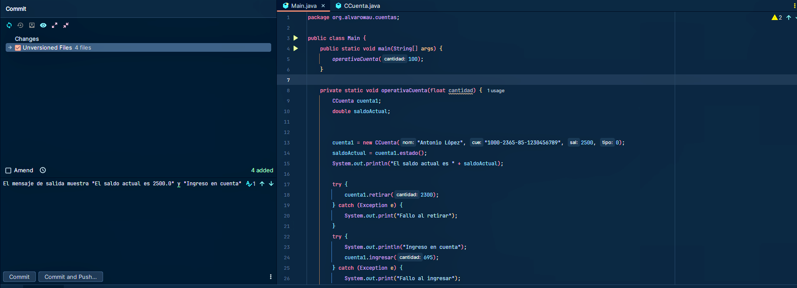
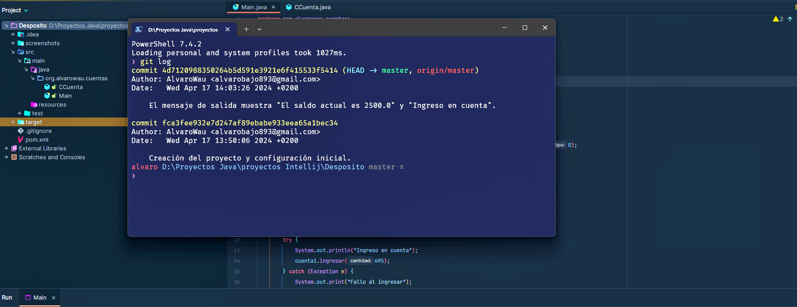
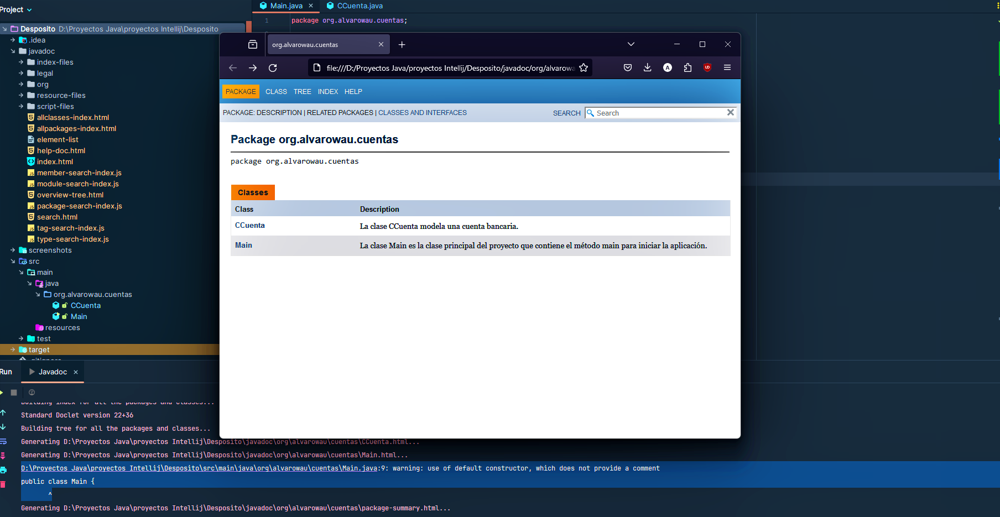

# Ejercicio: Refactorización, Git y JavaDoc

En el proyecto Java "Deposito", hay definida una Clase llamada CCuenta, que tiene una serie de atributos y métodos. El proyecto cuenta asimismo con una Clase Main, donde se hace uso de la clase descrita.

[Descarga el proyecto "Deposito"](https://github.com/alvarowau/bajo_tabero_alvaro_ED04_Tarea/raw/main/Deposito.rar)

## Basándonos en ese proyecto, vamos a realizar las siguientes actividades:

### REFACTORIZACIÓN

- Las clases deberán formar parte del paquete `cuentas`.
- Cambiar el nombre de la variable `miCuenta` por `cuenta1`.
- Introducir el método `operativa_cuenta`, que englobe las sentencias de la clase `Main` que operan con el objeto `cuenta1`.
- Encapsular los atributos de la clase `CCuenta`.
- Añadir un nuevo parámetro al método `operativa_cuenta`, de nombre `cantidad` y de tipo `float`.

### GIT

- Configurar GIT para el proyecto.
- Crear un repositorio público en GitHub.
- Realizar, al menos, una operación commit. Comentando el resultado de la ejecución.
- Mostrar el historial de versiones para el proyecto mediante un comando desde consola.

### JAVADOC

- Insertar comentarios JavaDoc en la clase `CCuenta`.
- Generar documentación JavaDoc para todo el proyecto y comprueba que abarca todos los métodos y atributos de la clase `CCuenta`.

## Soluciones

En este proyecto se ha llevado a cabo un ejercicio de refactorización en Java, configuración de Git y generación de documentación JavaDoc.

### Refactorización

En esta sección se detallan los pasos de refactorización realizados en el proyecto "Deposito":

1. **Paquete cuentas**: Se han agrupado las clases en el paquete `cuentas`.
   - Para esto, se creó un nuevo paquete `cuentas` y se movieron las clases `CCuenta` y `Main` a este paquete.

2. **Renombrar variable**: La variable `miCuenta` se ha renombrado a `cuenta1`.
   - Este cambio se realizó directamente en el archivo `Main.java`, modificando el nombre de la variable.

3. **Método operativa_cuenta**: Se ha introducido el método `operativa_cuenta`, que engloba las sentencias de la clase Main que operan con el objeto `cuenta1`.
   - Se agregó el método `operativa_cuenta` en la clase `Main.java`, que contiene el código previamente existente en el método `main`.

4. **Encapsulación de atributos**: Los atributos de la clase `CCuenta` se han encapsulado.
   - Los atributos `nombre`, `cuenta`, `saldo` y `tipoInteres` se hicieron privados y se agregaron métodos getter y setter para acceder a ellos.

5. **Nuevo parámetro**: Se ha añadido un nuevo parámetro al método `operativa_cuenta` llamado `cantidad` de tipo `float`.
   - Se modificó el método `operativa_cuenta` para que acepte un parámetro adicional `cantidad` de tipo `float`.

### Git

Se ha configurado Git para el proyecto y se han realizado operaciones de commit. A continuación se muestran los pasos realizados:

1. **Creación del repositorio**: Se creó un repositorio público en GitHub llamado `bajo_tabero_alvaro_ED04_Tarea`.
   - 

2. **Commit inicial**: Se realizó el primer commit con el mensaje "Creación del proyecto y configuración inicial".
   - 

3. **Historial de versiones**: Se muestra el historial de versiones del proyecto mediante el comando `git log`.
   - 

### JavaDoc

Se han insertado comentarios JavaDoc en la clase `CCuenta` y se ha generado la documentación JavaDoc para todo el proyecto.
   - 

   - ## Para más información

Para obtener más detalles sobre las soluciones implementadas o explorar el código fuente completo, te invitamos a revisar el proyecto en GitHub: [bajo_tabero_alvaro_ED04_Tarea](https://github.com/alvarowau/bajo_tabero_alvaro_ED04_Tarea).

Además, estoy siempre abierto a cualquier comentario, sugerencia o feedback que puedas tener. Si tienes alguna pregunta o deseas compartir tus observaciones, no dudes en ponerte en contacto conmigo. Estoy aquí para ayudarte y mejorar constantemente mis proyectos.

¡Gracias por tu interés y apoyo!

---

Álvaro Bajo

